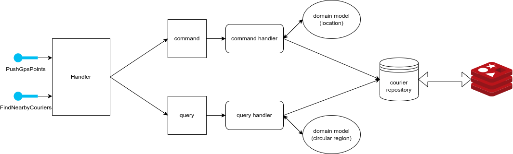
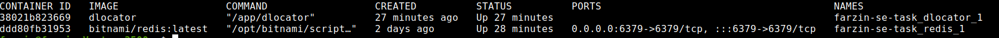

# DLocator

## Overall Architecture

The design of the application follows the principals of an idiomatic CQRS based approach while adhering to domain driven
design principles. The general schema of the system can be seen in the picture below:



while developing the application, maintaining a cohesive design and coding style while having decoupled structures and
services were in mind; hence you can find many reusable or interchangeable modules, services etc in the code. Of course,
its worth noting that to obey the constraint of the project I tried to maintain the previous code structured which in
some instances might cause inconsistency and less-ideal architecture code-wise.

# Finding points inside a circular region
I used Redis to search for points, more information here: [courier.go](./internal/pkg/service/cache.go)

## Tests

Not all the code is covered with tests however I tried to fully test the domain entities and have end-to-end tests for
the whole application. You can find the end-to-end test in this
file [courier_locator_test.go](./benchmarks/courier_locator_test.go)

## Deployment

At firs the idea was to build the whole source code inside a docker container, however due to US sanctions this process
took a lot of time and pron to errors, so currently for deploying the application you can use the following
instructions:

```shell
# cd to the parent working directory of the project
make dependencies # to download dependencies
make build # to build a binary output of the project
docker build -t dlocator .
docker run --rm dlocator # to run the image independently
docker-compose up
```



## In distributed environment

Suppose that due to increasing `push` or `query` request our service's performance has declined, or it simply can't meet
the quality required performance metrics, so need to distribute the service on multiple replicas.

Before looking for a solution we need to identify the problem, here we need to find the bottleneck of our service. Is it
the db? Is it the code? Is the network?

Fortunately, `dlocator` is very flexible in terms of having multiple replicas unless the problem(bottleneck)
is the db(redis). This project can have many replicas on different machines and scale to the performance needs only when
all the replicas are writing to the same database. But if keep a separate database for each replica then we face the
problem consistency(correctness condition), that is: if courier 1 writes to replica 1 and courier 2 writes to replica 2
and if both lay in the same region then querying replica 1 won't return courier 2 as the couriers inside the region. To
solve this problem we need aggregation services or read-only databases that collection information from all the
databases.

It is worth mentioning that to the event-driven nature of CQRS, it is easy to separate write and read operation into
different standalone services.

## Other notes
- pointers vs values: On most cases I used values instead of pointers, this was a conscious decision.  

Due to lack of time, some tradeoffs were maid:

- unideal test coverage and quality: go's built in testing framework lacks many features for developing and maintain good quality tests also my focus was mainly on getting the job down(meeting the Requirements) rather than developing good test cases.
- error handling: go's built in error library is very minimal and can not be used on production grade software. It's better to write customer wrappers around the interface or use third party libraries, due to reasons mentioned above I was unable to do so.
